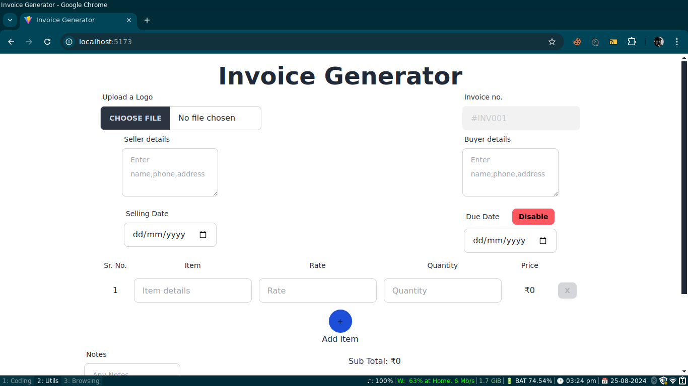

# Bill Generator


A simple and interactive bill generator built using React, Tailwind CSS, Daisy UI, and useReducer. This project allows users to enter items and dynamically calculates the total amount in real-time. The primary focus is on the frontend, providing a sleek and responsive user interface.

# Features
- Real-Time Calculation: Automatically updates the total amount as items are added or removed.
- Responsive Design: Tailwind CSS and Daisy UI ensure that the app looks great on all screen sizes.
- State Management: Utilizes useReducer for efficient and scalable state management.
- User-Friendly Interface: Simple and intuitive design for easy interaction.

# Tech Stack
- React: JavaScript library for building user interfaces.
- Tailwind CSS: Utility-first CSS framework for rapid UI development.
- Daisy UI: Tailwind CSS component library for customizable and accessible UI components.
- useReducer: A React hook for managing complex state logic in a predictable way.

# Installation
Clone the repository:

```bash
git clone https://github.com/your-username/bill-generator.git
```
Navigate to the project directory:

```bash
cd bill-generator
npm install
npm start
```
# Usage
- Add Items: Enter the item name, quantity, and price.
- Real-Time Updates: The total amount will update automatically as you modify the item list.
- Responsive Layout: The app is fully responsive and works seamlessly on all devices.

# Contributing
Contributions are welcome! Feel free to open an issue or submit a pull request with your enhancements.

# License
This project is licensed under the MIT License. See the LICENSE file for more details.
